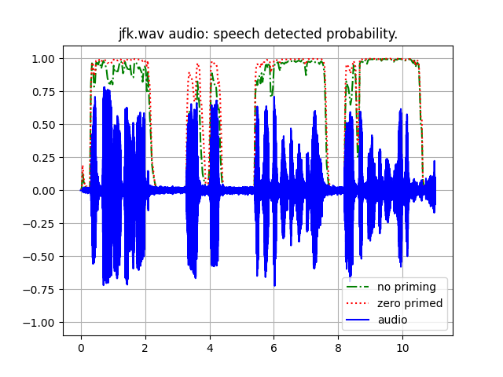

Silero VAD is a trained ML model for detecting speech in audio,
[GitHub repo](https://github.com/snakers4/silero-vad).

# Introduction

In this repo a test script uses the Silero VAD model to compute the probability
of speech in an audio file.  A second run resets the model and then "primes" the
model with some zero valued input before computing the probability of speech for
the same audio file - this additional "priming" step unexpectedly increases
the values of the predicted probability of speech.

# Installation

Run the test in a virtual environment on Ubuntu 22.04 Desktop operating system.

Clone this repo.
```console
cd
git clone git@github.com:guynich/silero-vad.git
```

Create the virtual environment and install packages.
```console
sudo apt install -y python3.10-venv

cd
python3 -m venv venv_silero-vad
source ./venv_silero-vad/bin/activate

cd silero-vad

pip install --upgrade pip
pip install -r requirements.txt
```

The test generates a plot requiring tkinter.
```
sudo apt-get install python3-tk
```

# Running the test

Activate the virtual environment and run the python script in a desktop GUI to
generate the below plot.
```console
cd
source ./venv_silero-vad/bin/activate

python3 main.py
```

The audio file has speech content (blue solid line).  It is a recording of a
speech by President John F Kennedy.

The Silero VAD model detects the speech correctly.  The second run with
"priming" (red dots) has higher probability values for the same audio file
than without priming (green dash dotted line).  The reason for this increase in
values is not understood.


